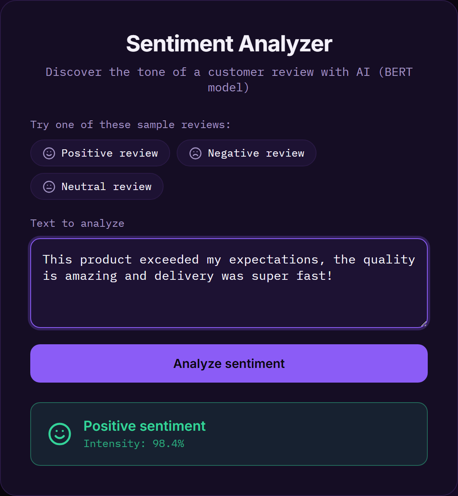
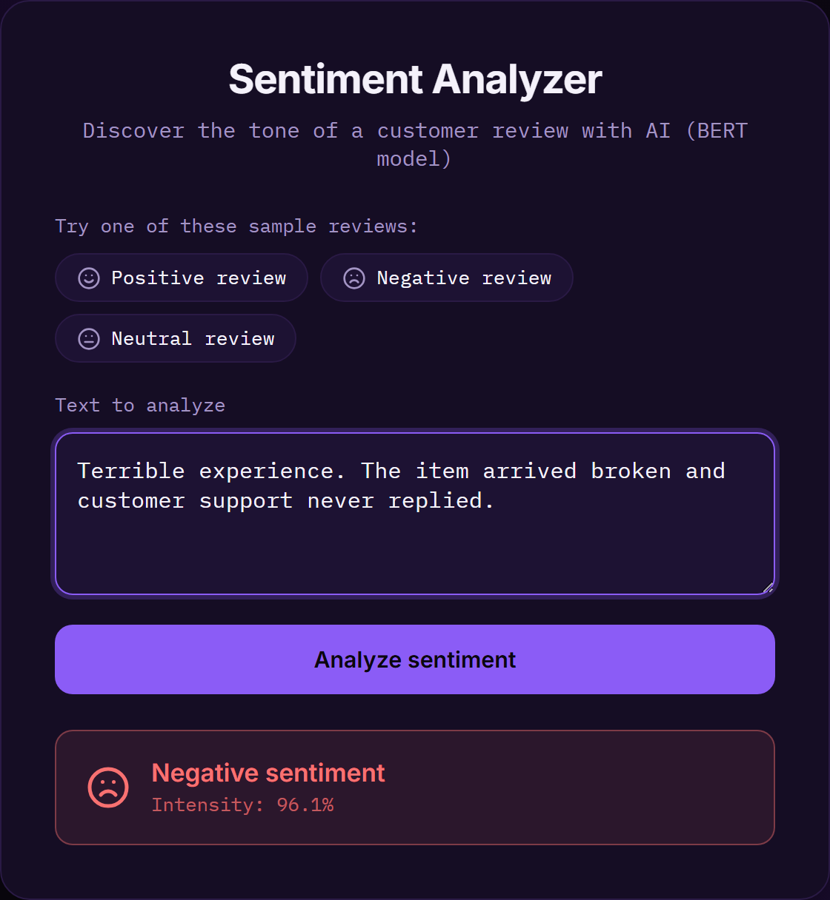
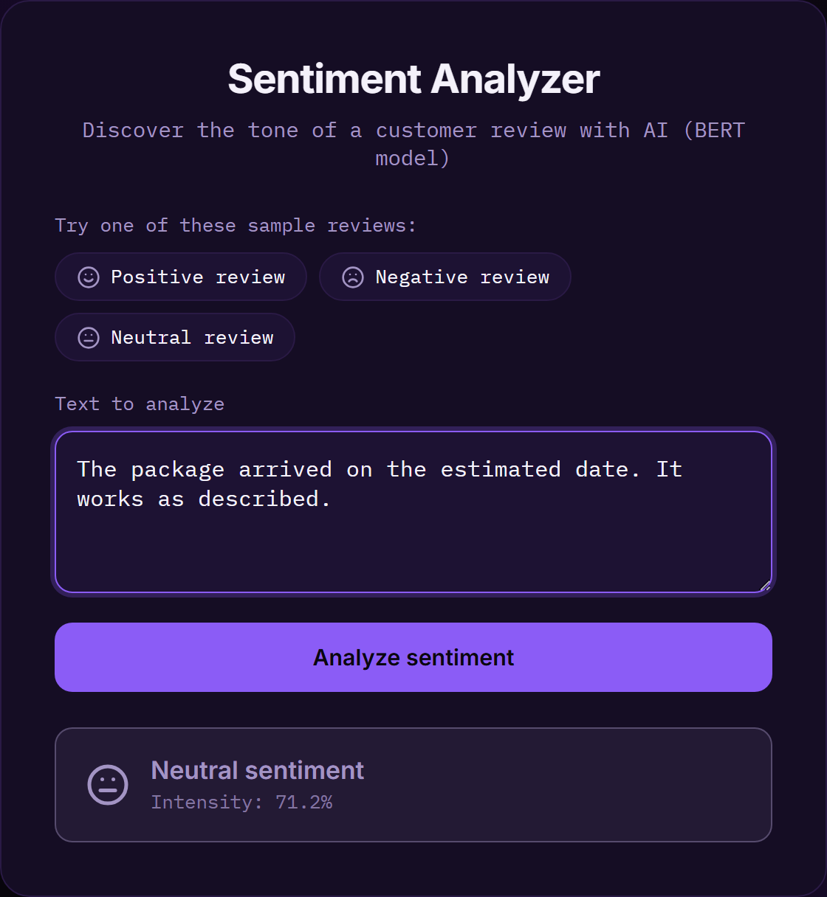
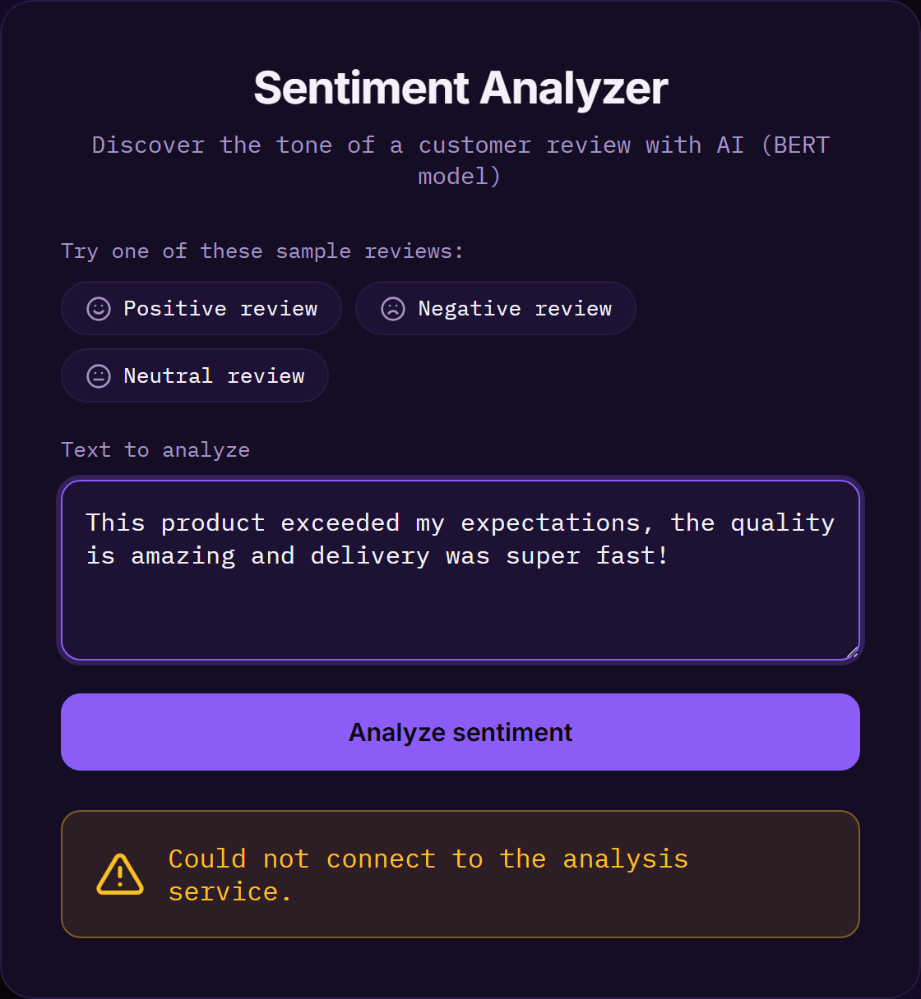

# Sentiment Analyzer (NLP with BERT)

Web application that analyzes the sentiment of a text and classifies it as
positive, negative or neutral, powered by the BERT model from the Watson NLP
service. The interface is intentionally straightforward: enter a text, press a
button, and get the predominant tone along with its intensity.

## Use case

The primary scenario is **customer review analysis**. Any business that
receives feedback about its products or services needs to quickly understand
whether user perception is favorable or not, especially as the volume of
opinions grows and reading them one by one becomes impractical.

With this tool, a member of a customer support or product team can paste a
customer's comment and instantly know whether it expresses satisfaction,
dissatisfaction or a neutral stance, as well as the intensity with which the
model holds that classification. The page includes three sample reviews that
let you try the application's behavior with a single click, without having to
write your own text.

Although the example focuses on reviews, the same logic applies to other
contexts where measuring the tone of free-form text is useful, such as survey
responses, support messages or social media posts.

## Tools used

| Area | Tool |
|------|------|
| Language | Python 3 |
| Web framework | Flask (application factory pattern with blueprints) |
| AI model | BERT via the Watson NLP service (IBM Skills Network) |
| HTTP client | `requests` library |
| Interface | HTML5, CSS3 and JavaScript (with the `fetch` API) |
| Typography | Inter (titles) and IBM Plex Mono (body), via Google Fonts |
| Iconography | Inline SVG icons |
| Screenshots | Playwright (browser automation) |

## Project structure

```
practice_project/
├── app/                    # Flask application package
│   ├── __init__.py         # Application factory
│   ├── routes.py           # Routes / endpoints
│   ├── analyzer.py         # Sentiment service client
│   ├── static/
│   │   ├── css/styles.css
│   │   └── js/main.js
│   └── templates/
│       └── index.html
├── docs/screenshots/       # Interface screenshots
├── run.py                  # Entry point
├── requirements.txt
├── LICENSE
└── README.md
```

## Screenshots

### Positive sentiment

When the text conveys satisfaction, the result is shown in green with a smiling
face icon and the intensity computed by the model.



### Negative sentiment

For a text that expresses dissatisfaction, the result is presented in red with a
frowning face icon.



### Neutral sentiment

If the text does not lean toward either extreme, the result appears in a neutral
tone with an impassive face icon.



### Error state

When the input is empty or the service is unavailable, the application does not
crash: it shows a descriptive message in amber accompanied by a warning icon,
informing the user of what happened.



## Installation and usage

```bash
pip install -r requirements.txt
python run.py
```

Then open <http://localhost:5000> in your browser.

## License

[MIT](LICENSE) © 2026 Wesley Ruiz
